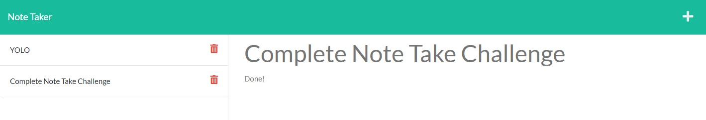

  # Awesome Note Taker v1.0 

  ### A project by: Doug Erickson 

  The objective of the project was to create an Express server with API End Points to provide GET, POST and DELETE services for a web based note taker application. 

  ---
  ## Installation
  #### If you want to run the application, you will need to install NodeJS, Express, and FS. Start with 'node server' to run on local host on port 3001.
  NOTE: Heroku does not seem to allow access to the JSON dB file so to test, you will need to download and install Node and dependencies.
 
  ## Media
  Screenshot:
  

  [Heroku URL](https://awesome-note-taker-a1.herokuapp.com/)

  [Github Repo](https://github.com/Crimsondrac1/AwesomeNoteTaker)